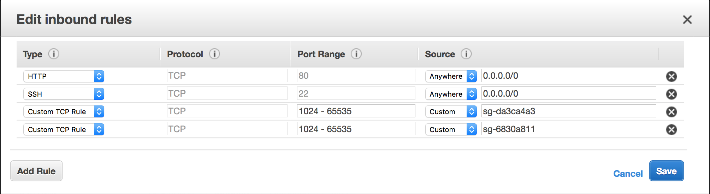
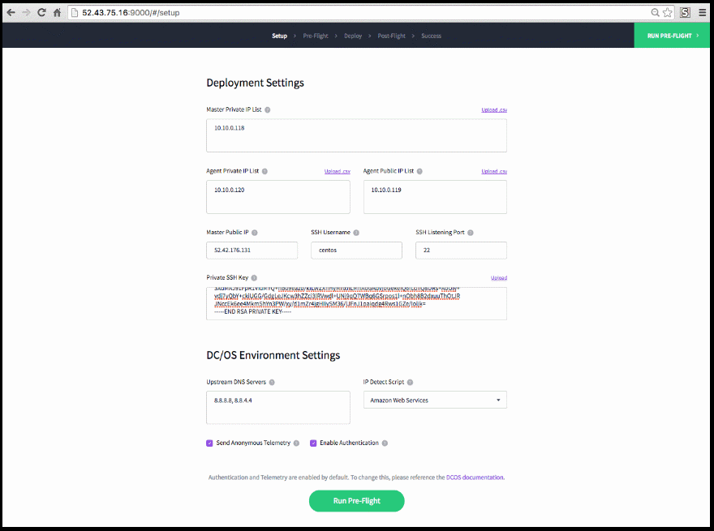

# Table of Contents
## DEVOPS
### [Ambari Setup on EC2](https://github.com/ifilonenko/data-analytics#setting-up-apache-ambari-on-ec2)
### [DC/OS Setup on EC2](https://github.com/ifilonenko/data-analytics#setting-up-a-dcos-cluster)
## MANAGING CLUSTER ON AMBARI
### [Ambari Loadup on EC2](https://github.com/ifilonenko/data-analytics#ambari-loadup-on-ec2-1)

## Ambari Loadup on EC2
This is a guide to load up the hadoop ecosystem to begin writing big data applications that interact with HDP
* Start all nodes: ambariNode1,ambariNode2,ambariHead on ec2
* Start ambari-server on ambariHead
```bash
ssh -i ec2-user@[master_public_ip]
sudo ambari-server start
```
* Go to [master_public_ip]:8080
* Login into Ambari using our login information

### Starting all services
* Start services in this order and ensure there are no errors
  * HDFS (Hadoop file system)
  * YARN (resource manage)
  * Hive (HiveSQL for Hadoop)
  * ZooKeeper (Leader election)
  * HBase (noSQL key-value store)
  * Kafka (broker for consumer-producer pipelining)
  * Spark (in-memory cluster computing)
  * OTHER appplications are optional and we will look into them further

## Setting up Apache Ambari on EC2
This guide describes to to manually setup Ambari on EC2 for the purpose of setting up a custom Hadoop environment using HDP (Hortonworks' build packages)

Used this video for walkthrough: [here](https://www.youtube.com/watch?v=6-RY4Ll6ABU)

### Create 1 m4.large instance for Ambari Head
* Redhat enterprise
* Protect against accidental termination
* Add 100GB magnetic storage (delete on termination)
* Use security group called Ambari Cluster (this security group should be same as [here](https://community.hortonworks.com/questions/10728/ambari-fails-to-register.html))
* Create or use appdev pemfile

### Setup base image
* SSH as ec2-user to public ip address
```bash
ssh -i ec2-user@[master_public_ip]
```
* Check location
```bash
lsblk
```
* Format 100GB drive
```bash
sudo mkfs -t ext4 /dev/xvdb
```
* Mount the drive
```bash
sudo mkdir /grid && sudo mount /dev/xvdb /grid
```
* Add info to /etc/fstab to be pernament mount
```bash
/dev/xvdb /grid ext4 defaults,nofail 0 2
```
* Reboot and reconnect
* Disable SELinux
	* in /etc/sysconfig/selinux
```bash
SELINUX=disabled
```
* Install and disable firewall
```bash
sudo yum install firewalld
sudo systemctl disable firewalld
sudo service firewalld stop
```
* Install ntp
```bash
sudo yum install ntp
```
* Start ntpd
```bash
sudo systemctl enable ntpd
sudo systemctl start ntpd
```
* Check umask
```bash
umask
```
  * If umask is 0002 edit (/etc/profile) to have umask be just 0022 (remove if statement clause)
* Generate ssh key for connecting between machines
```bash
ssh-keygen -t rsa
```
* Reboot 
```bash
sudo reboot
ssh -i ec2-user@[master_public_ip]
```
* Ensure that umask is 0022
```bash
umask
```
* Add new key to authorized_keys
  * This is for connecting between the clusters easily
  ```bash
  cat .ssh/id_rsa.pub >> .ssh/authorized_keys
  ```
* Go to AWS dashboard and create image based on this instance

### Spinning up other machines
* Go into AWS Console and create new instances
  * Same m4.large size as ambari instance
* Under configure instance Add the following lines "as text":
```bash
sudo mkdir /grid
sudo mkfs -t ext4 /dev/xdvb
sudo mount /dev/xdvb /grid
```
* Once created, add the list of hosts to all machines (/etc/hosts)

### Install Ambari
* Connect to the Ambari Machine
* Install wget
```bash
sudo yum install wget
```
* Add the hdfp ambari repo 
```bash
sudo wget -nv http://public-repo-1.hortonworks.com/ambari/centos7/2.x/updates/2.4.0.1/ambari.repo -O /etc/yum.repos.d/ambari.repo
```
* Update yum
```bash
sudo yum repolist
```
* Install ambari server 
```bash
sudo yum install ambari-server
```
* Setup ambari-server
```bash
sudo ambari-server setup
```
  * Use defaults (No custom user account, java8, accept agreement, no advanced db config)
* Start ambari-server
```bash
sudo ambari-server start
```
* SOLVING KNOWN ISSUES:
  * [known issues](https://docs.hortonworks.com/HDPDocuments/Ambari-2.1.0.0/bk_releasenotes_ambari_2.1.0.0/content/ambari_relnotes-2.1.0.0-known-issues.html)
  * For each host:
  ```bash
  sudo yum install ntp
  sudo systemctl enable ntpd
  sudo systemctl start ntpd
  sudo yum remove snappy
  sudo yum install snappy-devel
  ```
  * On head-node:
    * Increase NameNode heap-size to 2GB
    * Follow these directions to get around curl (52) error
    ```bash
    sudo -u hdfs hadoop fs -put /usr/hdp/2.5.3.0-37/hadoop/mapreduce.tar.gz /hdp/apps/2.5.3.0-37/mapreduce/
    sudo cp /usr/hdp/2.5.3.0-37/etc/atlas/conf.dist/client.properties /etc/atlas/conf/
    ```

### Create Cluster
* Connect through browser to ambari at public_url:8080
* Username: admin Password: admin
* Name the cluster
* Select HDP2.5.3 (HDP version 2.5.3)
  * Under Advanced Options unselect all repos that arent rhel7
* For target hosts, copy the privateDNS addresses for all machines
* For SHH key, paste in the id_rsa file that was generated
* User is ec2-user


### Setting up a DC/OS cluster

This guide describes how to manually setup a DC/OS cluster on AWS machines.

### System Requirements

Setting up DC/OS requires the following ec2 servers
* A bootstrap node
  * This node performs the initial setup of DC/OS on the rest of the nodes in your cluster, installing any necessary packages.
  * This node is temporary and can be relatively low power (t2.micro will do)
* 1, 3, or 5 master nodes running Red Hat or CentOS
  * Master nodes receive jobs and distribute those jobs to agent nodes. DC/OS recommends at least 3 master nodes for fault tolerance, but you can get away with just a single master node.
  * Recommended m3.xlarge instances, but m3.medium and up will suffice.
* Any number of agent nodes running Red Hat or CentOS
  * Agent nodes receive jobs from master nodes.
  * Recommended m3.xlarge instances, but m3.medium and up will suffice.

### Setting up Servers

Deploy the servers described above on Amazon EC2 through the GUI or the CLI. All the nodes should
be deployed in the same availability zone (ex. 2c).

### Security Group

For your bootstrap node's security group, set HTTP (80) and SSH (22) ports to available anywhere, and also
set port 9000 to available anywhere. You will be shutting down the bootstrap node right after the install
process so security isn't a huge deal.

For the cluster nodes (masters and agents) set SSH and HTTP to available anywhere, and additionally,
add custom TCP rules for ports 1024-65535 for inbound traffic from this security group and the
bootstrap node's security group. The image below is what your resulting security group should look like.



### Updating Software

ssh into each of your master and agent servers, and run `sudo yum update -y`.

### Configuring DC/OS cluster

ssh into your bootstrap node and download the DC/OS installer.

```bash
curl -O https://downloads.dcos.io/dcos/stable/dcos_generate_config.sh
```

and start the DC/OS GUI installer.

```bash
sudo bash dcos_generate_config.sh --web
```

Next, point your browser to `http://bootstrap-node-ip:9000. You should be met by the following landing page.
click Begin Installation.


Specify your deployment settings on the following page.



### Settings

#### Master Private IP List

Comma separated list of all the private ip's of your masters.

#### Agent private IP List

Comma separated list of all the private ip's of your private agents.

#### Agent Public IP List

Comma separated list of all the private ip's of your public agents.

#### Master Public IP

The public IP for one of your master nodes.

#### SSH username

The username when you SSH into any of the nodes in your cluster (eg. ec2-user).

### SSH Listening Port

Should be 22.

### Private SSH Key

The SSH key you created when you setup your cluster. Copy and paste the contents of the .pem file into here.

### Deployment

Hit run pre-flight, followed by deploy, followed by run post-flight. After the entire setup is complete, you
will be redirected to login to your DC/OS cluster GUI interface. At this time, you can shutdown the bootstrap
node.
